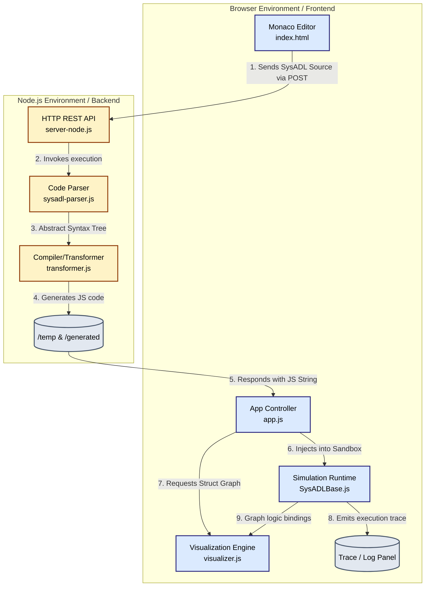

# SysADL Web Studio - Architecture & Requirements

## 1. Requirements Overview

### 1.1. Functional Requirements
1. **Model Editor:** The system MUST provide an integrated code editing environment with syntax highlighting for the SysADL modeling language.
2. **Back-end Transformation:** The system MUST process raw SysADL text into an executable JavaScript simulation model using a dedicated Node.js parsing/compilation engine.
3. **Simulation Execution:** The system MUST support executing the translated JavaScript representation inside the client browser to test logical flows, state progression, and discrete events.
4. **Structural Visualization:** The system MUST generate a dynamic, interactive graph (nodes and edges) illustrating the architectural composition—components, ports, and data connectors.
5. **Trace Animation:** The system MUST allow step-by-step or continuous playback of the simulation, visually tracing data pulses across component connectors.
6. **Robust Logging & Extraction:** The system MUST capture component simulation events into a structured trace. Furthermore, it MUST distinguish between parameter injection (boundary outputs) and outcome monitoring (boundary inputs), allowing users to filter architectural instantiation noise and extract/display exact final states distinctively post-simulation.

### 1.2. Non-Functional Requirements
1. **Client-Server Architecture:** Transformation must be offloaded to a Node.js server to bypass browser memory bounds and module loading difficulties, guaranteeing a lightweight client footprint.
2. **Rendering Performance:** The visualization engine (`vis-network`) must be capable of rendering complex hierarchical graphs at a high frame rate without input lag.
3. **Usability & UX:** The interface must strictly separate distinct activities (Authoring, JS Inspection, Graph Rendering, Log Viewing) through an intuitive grid layout with a polished, accessible color theme. It must actively segregate execution configuration (inputs/traces) from execution results (visual highlighting of Final Component Values) independent of raw log text.

---

## 2. System Architecture Diagram

---

## 3. Architecture Component Details

### 3.1. Frontend UI Controller (`app.js`)
Acts as the central coordination hub. It handles DOM events, controls the Monaco code editors, orchestrates interactions between the browser and the Node API, and triggers state updates for the visualization and trace playback widgets.

### 3.2. Backend REST API (`server-node.js`)
Decouples heavy lifting from the browser. It exposes the `/api/transform` endpoint, writing the incoming SysADL model to a temporary file map, and spawns `transformer.js` natively. This guarantees full compatibility with Node file-system logic and avoids client-side bloat.

### 3.3. Transformation Engine (`transformer.js` & `sysadl-parser.js`)
The primary compiler inside the backend context. It leverages a PEG.js generated parser to digest SysADL syntax into an AST, traversing it to yield executable JavaScript definitions that inherit explicitly from the `SysADLBase` abstractions. 

### 3.4. Simulation Engine (`sysadl-framework/SysADLBase.js`)
The browser-side logic core. It provides the semantics and base classes (`Component`, `SimplePort`, `CompositePort`, `Connector`, `Enum`, `DataType`) required to emulate continuous physical behaviors and object-oriented component communication without needing server round-trips for real-time calculation.

### 3.5. Visualization Engine (`visualizer.js`)
Responsible for reading the compiled component footprint, instantiating the classes transiently to read `boundParticipants`, and invoking the `vis-network` API. It features custom event hooks restricting nested child components within parent bounding boxes and aligning external data ports natively along the geometric borders to emulate UML-like aesthetic diagrams.
