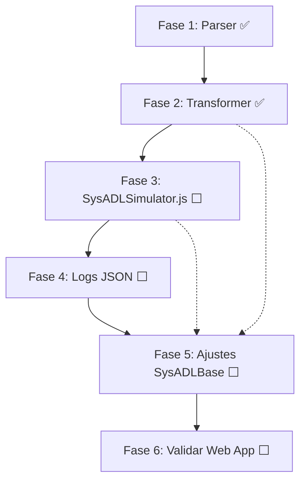

# Plano: Simulador SysADL Integrado

## Contexto

O objetivo é criar um simulador integrado funcional que:
1. Receba um `.sysadl` (nova gramática) → transforme → execute cenários → gere resultados
2. Mantenha a aplicação web (simulator.js) funcionando para simulação estrutural
3. Gere resultados no estilo JUnit (✅/❌ por cenário/cena)

O arquivo de referência para a nova gramática é `sysadl-models/RobAFIS.complete.sysadl`.

---

## Decisões de Arquitetura (Aprovadas)

| Decisão | Escolha |
|---|---|
| Simuladores | Dois complementares: `simulator.js` (web) + `SysADLSimulator.js` (CLI) |
| Transformer | Adaptação incremental — só reescrita da parte env/scen |
| Primeiro milestone | RobAFIS.complete.sysadl end-to-end |
| Composição hierárquica | EnvComponents com composição recursiva (similar a Component) |
| Execução paralela | Simulada (sequencial com estado compartilhado) no primeiro milestone |

---

## Fase 1: Validar Parser com RobAFIS.complete.sysadl — ✅ CONCLUÍDA

- Parser valida RobAFIS.complete.sysadl sem erros
- 18/18 tipos de nós AST reconhecidos
- AST dump em `sysadl-models/RobAFIS.complete-ast.json`
- Script de teste em `test/test-parser.js`

---

## Fase 2: Atualizar Transformer para Nova Gramática — ✅ CONCLUÍDA

### O que foi feito

A função `generateEnvironmentModule()` em `transformer.js` foi completamente reescrita para suportar a nova gramática PEG, mantendo compatibilidade com a gramática antiga.

#### Alterações em `transformer.js`:

1. **`hasEnvironmentElements()` (L7131)** — Detecta nós da gramática nova E antiga
2. **`separateElements()` (L7165)** — Classifica nós AST para os dois módulos de saída
3. **`generateEnvironmentModule()` (L4102-5350)** — Reescrita completa:
   - Coleta de elementos AST via `traverse()` com switch
   - Detecção automática de gramática (nova vs antiga)
   - Geração de classes para todos os tipos: EP_, ECN_, ECP_, BEX_, ENVACT_, SCN_, Scenario_, ScenarioExecution
   - Factory function `createEnvironmentModel()`
4. **`envExprToJS()` (L4220)** — Novo helper que converte AST expressions para JS válido
   - Suporta: Identifier, PropertyAccess, ArrayAccess, EnumAccess, QualifiedName, BooleanLiteral, NumberLiteral, StringLiteral, LogicalExpression, BinaryExpression, ComparisonExpression, Assignment
5. **Deduplicação de classes** (L2826) — `_generatedClassNames` Set previne classes Action duplicadas

#### Resultado da geração:

| Elemento | Esperado | Gerado |
|---|---|---|
| EnvPortDefs | 10 | ✅ 10 |
| EnvConnectorDefs | 8 | ✅ 8 |
| EnvComponentDefs | 12 | ✅ 12 |
| BoundaryExtensions | 5 | ✅ 5 |
| EnvConfigs | 6 | ✅ 6 |
| EnvActivities | 1 | ✅ 1 |
| Scenes | 16 | ✅ 16 |
| Scenarios | 10 | ✅ 10 |
| ScenarioExecutions | 2 | ✅ 2 |

#### Bugs pendentes da Fase 2:
- **onClauses vazios**: ✅ CORRIGIDO. Os arrays `onClauses` nas activities geradas (OperatorEA e UnitEA) foram populados corretamente (26 clauses no total).
- **Constraint equation**: ✅ CORRIGIDO. Corrigida a conversão de `equation = x == y` nas constraints do Model.js, tratando as expressões de PropertyAccess e Identifier corretamente.

---

## Fase 3: Refatorar SysADLSimulator.js — ⬜ NÃO INICIADA

### [MODIFY] `SysADLSimulator.js`

Redesenhar completamente a lógica de binding e execução:

**3.1. Eliminar binding manual (performBinding)**

O `performBinding()` atual é frágil. O código gerado pelo transformer (Fase 2) já resolve tudo internamente:
- `BoundaryComponentExtension` gera bridges entre envPorts e ports do sistema
- `environmentConfiguration` instancia sub-envComponents e cria envConnectors com bindings
- `envDelegations` conectam portas entre níveis hierárquicos
- `envConnectors` com bindings conectam envPorts de EnvComponents a ports de system Components

O `SysADLSimulator.js` deve:
1. Transformar `.sysadl` → `Model.js` + `Model-env-scen.js`  
2. Carregar **apenas** o `Model-env-scen.js` (que internamente carrega `Model.js`)
3. Executar cenários diretamente — sem binding manual

**3.2. Resultado no estilo JUnit (adaptado para RobAFIS)**

Implementar um `ScenarioReporter` que gere saída assim:

```
╔═══════════════════════════════════════════════════════╗
║      SysADL Scenario Execution: RobAFIS               ║
║      Mode: once                                       ║
╚═══════════════════════════════════════════════════════╝

▶ RobAFIS_Validation_Run_P0
  ├── [PARALLEL]
  │   ├── Scenario_RoutingLogic_P0_Unit1
  │   │   ├── SCN_MatrixDecision_SA_Unit1
  │   │   │   ├── Preconditions:  ✅ PASS
  │   │   │   │   ├── operator1.outParam == P0    ✅
  │   │   │   │   └── unit1.transElevator.outPieceColor == P1    ✅
  │   │   │   ├── Execution:      ✅ PASS (extractPieceT → routeToSA)
  │   │   │   └── Postconditions: ✅ PASS
  │   │   │       └── unit1.navPad.outColor == Green    ✅
  │   │   └── SCN_MatrixDecision_SPD_Unit1
  │   │       ├── Preconditions:  ✅ PASS
  │   │       ├── Execution:      ✅ PASS
  │   │       └── Postconditions: ✅ PASS
  │   │   Result: ✅ PASS (2/2 scenes)
  │   │
  │   ├── Scenario_ObstacleHandling_Unit1
  │   │   ├── SCN_ObstacleStop_Unit1     ✅ PASS
  │   │   └── SCN_ObstacleResume_Unit1   ✅ PASS
  │   │   Result: ✅ PASS (2/2 scenes)
  │   ...
  │
  Result: ✅ PASS (8/8 scenarios in parallel block)

═══════════════════════════════════════════════════════
Summary: 8 passed, 0 failed (8 total scenarios)
═══════════════════════════════════════════════════════
```

**3.3. Novo fluxo de execução**

```
SysADLSimulator.run(file.sysadl)
  1. transform(file.sysadl) → Model.js + Model-env-scen.js
  2. loadModel(Model-env-scen.js) → envModel (internamente carrega Model.js)
  3. setupLogging(envModel) → ScenarioReporter + JSON logger
  4. Para cada ScenarioExecution (ex: RobAFIS_Validation_Run_P0):
     4.1. Aplicar mode (once, etc.)
     4.2. Aplicar initial assignments (unit1.transElevator.pieces[0].outPresence = true, etc.)
     4.3. Registrar injects com timing (immediate, after N)
     4.4. Executar body:
          - Se ParallelBlock: executar scenarios em paralelo (simulado)
          - Se ScenarioCall: executar scenario sequencialmente
          - Para cada Scenario:
            - Para cada Scene:
              - Avaliar preconditions → PASS/FAIL
              - Se PASS: executar cadeia ON/THEN/SEND (start → finish)
              - Avaliar postconditions → PASS/FAIL
          - Reportar resultado do Scenario
     4.5. Reportar resultado geral
  5. Salvar logs JSON
```

> [!WARNING]
> **Desafio: Execução Paralela**
> O RobAFIS usa `parallel { ... }` para executar 8 cenários concorrentemente. Para o primeiro milestone, sugiro execução **simulada** (sequencial com estado compartilhado). Futuramente pode ser real (async/Promise.all).

---

## Fase 4: Formato de Logs — ⬜ NÃO INICIADA

### Log JSON Estruturado (novo formato para SysADLSimulator)

```json
{
  "simulation": {
    "model": "RobAFIS",
    "timestamp": "2026-06-10T14:30:00Z",
    "mode": "once",
    "duration_ms": 1234
  },
  "scenarios": [
    {
      "name": "Scenario_RoutingLogic_P0_Unit1",
      "status": "PASS",
      "scenes": [
        {
          "name": "SCN_MatrixDecision_SA_Unit1",
          "status": "PASS",
          "preconditions": {
            "status": "PASS",
            "conditions": [
              { "expression": "operator1.outParam == P0", "result": true }
            ]
          },
          "execution": {
            "status": "PASS",
            "start_event": "extractPieceT",
            "finish_event": "routeToSA",
            "trace": [
              { "step": 1, "signal": "ExtractedPieceTSig", "action": "routeToSA" }
            ]
          },
          "postconditions": {
            "status": "PASS",
            "conditions": [
              { "expression": "unit1.navPad.outColor == Green", "result": true }
            ]
          }
        }
      ]
    }
  ],
  "summary": {
    "total_scenarios": 10,
    "passed": 10,
    "failed": 0,
    "total_scenes": 16,
    "scenes_passed": 16,
    "scenes_failed": 0,
    "scenes_skipped": 0
  }
}
```

### Log do simulator.js (manter como está)

O log `[EVENT]` do `simulator.js` continua sendo a base para animação no `visualizer.js`. Nenhuma mudança necessária.

---

## Fase 5: Atualizar Framework (SysADLBase) se necessário — ⬜ NÃO INICIADA

### [MODIFY] `sysadl-framework/SysADLBase.js`

Possíveis ajustes:
- Garantir que `EnvironmentConfiguration` crie instâncias acessíveis (entities como propriedades)
- Ajustar `ScenarioExecution` / `SceneExecutor` para reportar resultados de pre/post conditions de forma estruturada
- Garantir que `EnvConnector` ao ser acionado dispare o fluxo na porta do sistema correspondente

> [!NOTE]
> A extensão do framework depende muito de como o SysADLSimulator.js for implementado na Fase 3. Se o código gerado resolver tudo via `createEnvironmentModel()`, o framework pode precisar de poucas mudanças.

---

## Fase 6: Manter Aplicação Web Funcionando — ⬜ NÃO INICIADA

### Sem mudanças necessárias

- `simulator.js` — continua como está
- `visualizer.js` — continua como está
- `app.js` — continua como está
- `server-node.js` — continua como está

A única interação é que o `server-node.js` chama o `transformer.js`, que foi atualizado na Fase 2. Mas as mudanças no transformer afetam apenas a geração do `*-env-scen.js`, não do `Model.js` principal que a web usa.

---

## Verification Plan

### Automated Tests

```bash
# Fase 1: Parser ✅
node test/test-parser.js sysadl-models/RobAFIS.complete.sysadl

# Fase 2: Transformer ✅
node transformer.js sysadl-models/RobAFIS.complete.sysadl -o generated/
node --check generated/RobAFIS.complete-env-scen.js
# (usar mock para testar carga — ver technical_reference.md seção 5)

# Fase 3: Simulador
node SysADLSimulator.js sysadl-models/RobAFIS.complete.sysadl --verbose

# Fase 6: Web app continua funcionando
node server-node.js  # abrir browser e testar transform + simulate com Simple.sysadl
```

### Manual Verification

1. Executar `SysADLSimulator.js` com RobAFIS.complete.sysadl
2. Verificar que o output JUnit-style mostra PASS/FAIL corretamente para os 2 ScenarioExecutions (P0 e P1)
3. Verificar que os 8 cenários em cada parallel block são reportados
4. Verificar que o log JSON contém todos os dados esperados
5. Abrir a aplicação web, carregar Simple.sysadl, transformar, simular — tudo deve continuar funcionando

---

## Ordem de Execução



> [!TIP]
> As fases 3, 4 e 5 são iterativas — mudanças no simulador podem exigir ajustes no framework e vice-versa. A melhor abordagem é fazer ciclos curtos de: executar → ajustar.
> 
> **Milestone 1:** RobAFIS.complete.sysadl funcionando end-to-end
> **Milestone 2:** Migrar AGV-completo.sysadl para nova gramática e testar
