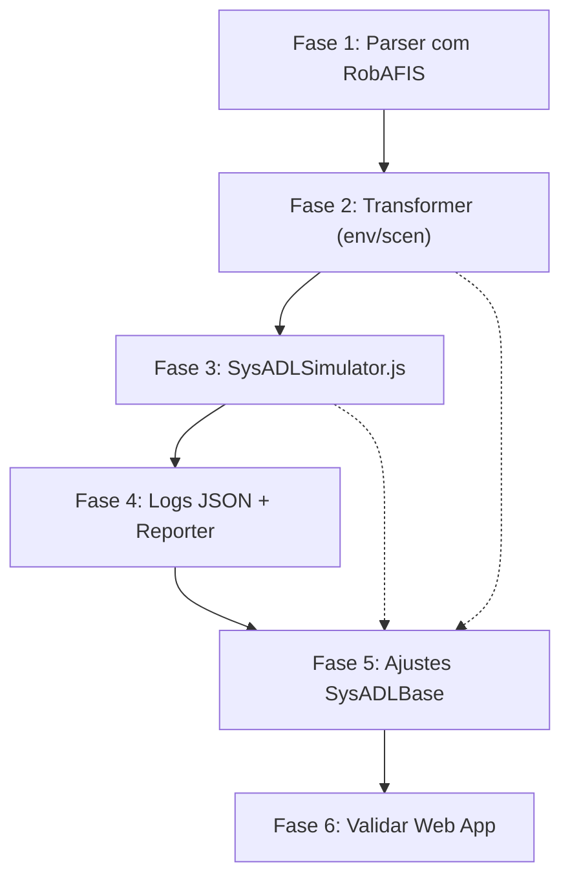

# Plano: Simulador SysADL Integrado

## Contexto

O objetivo é criar um simulador integrado funcional que:
1. Receba um `.sysadl` (nova gramática) → transforme → execute cenários → gere resultados
2. Mantenha a aplicação web (simulator.js) funcionando para simulação estrutural
3. Gere resultados no estilo JUnit (✅/❌ por cenário/cena)

O arquivo de referência para a nova gramática é [RobAFIS.complete.sysadl](file:///Users/tales/desenv/SysAdlWebStudio/tales/v0.6/sysadl-models/RobAFIS.complete.sysadl).

---

## User Review Required

> [!IMPORTANT]
> **Decisão de Arquitetura: Dois Simuladores Complementares**
> 
> Minha sugestão é manter **dois simuladores com papéis distintos**, em vez de fundir tudo em um só:
> 
> | Simulador | Papel | Interface |
> |---|---|---|
> | `simulator.js` | Simulação **estrutural** (ports, connectors, activities) | Web (browser) |
> | `SysADLSimulator.js` | Simulação **integrada** (environment + scenarios + sistema) | CLI (Node.js) |
> 
> **Razão:** O `simulator.js` já funciona bem no browser e gera o trace para animação gráfica. O melhor é que o `SysADLSimulator.js` **reutilize o motor de execução do modelo** (as classes de `SysADLBase.js` — Model, Component, Port, Connector, Activity, Action, Executable) diretamente, sem "chamar" o `simulator.js`.
> 
> No futuro, quando você adicionar a parte gráfica de ambiente/cenários na web, o `SysADLSimulator.js` pode expor uma API ou gerar logs que a interface web consome.

---

## Open Questions

> [!IMPORTANT]
> 1. **Scope do transformer:** O transformer.js (420KB) foi escrito para a gramática antiga. A parte structural/behavioral/executable não mudou na gramática, então continua válida. Apenas a geração env/scen precisa ser **reescrita** para a nova gramática. Confirma?
> 
> 2. **Primeiro milestone:** O RobAFIS.complete.sysadl será o primeiro arquivo de teste, já que é o único na nova gramática. Depois de funcionar, migramos o AGV-completo. Correto?
>
> 3. **Hierarquia de environmentConfiguration:** O RobAFIS usa composição hierárquica profunda (AtelierEnvironment → ProductionUnitEnvCP → TransElevatorEnvCP → PieceEnvCP). O framework SysADLBase precisa suportar essa composição recursiva de EnvComponents com suas configurações internas. Posso seguir por esse caminho?

---

## Proposed Changes

### Fase 1: Validar Parser com RobAFIS.complete.sysadl

> [!NOTE]
> Usar o [RobAFIS.complete.sysadl](file:///Users/tales/desenv/SysAdlWebStudio/tales/v0.6/sysadl-models/RobAFIS.complete.sysadl) como test case real do parser.

#### [NEW] `test/test-parser.js`
- Script que parseia o RobAFIS.complete.sysadl com o novo parser e imprime a AST
- Validar que todos os novos elementos são reconhecidos corretamente

#### [MODIFY] [sysadl.peg](file:///Users/tales/desenv/SysAdlWebStudio/tales/v0.6/sysadl.peg) (se necessário)
- Corrigir regras que falharem ao parsear o RobAFIS
- Regenerar `sysadl-parser.js` após ajustes

**Padrões identificados no RobAFIS que o parser deve suportar:**

| Padrão | Exemplo no RobAFIS | Regra PEG |
|---|---|---|
| EnvPort como ElementDef em package | `EnvPort def OutPieceColor { flow out PieceType }` | `EnvPortDef` ✅ |
| EnvConnector com participants/flows | `EnvConnector def DetectPieceColorEnvCN { participants: ~ ...; flows: ... }` | `EnvConnectorDef` ✅ |
| EnvComponent com envPorts tipados | `EnvComponent def PieceEnvCP { envPorts: outColor : OutPieceColor ; ... }` | `EnvComponentDef` — usa `PinUse` ✅ |
| EnvComponent com properties tipadas | `Property def color : PieceType ;` | `EnvPropertyDef` ✅ |
| BoundaryComponentExtension | `boundary component SysADL.Components::ParameterInputCP { envPorts: inParam : InParameter ; }` | `BoundaryComponentExtension` ✅ |
| environmentConfiguration **embutido** | `environmentConfiguration TransElevatorConfig { envComponents: ...; envDelegations: ...; }` | `EnvironmentConfiguration` ✅ |
| environmentConfiguration com **components** (sistema) | `components: unit_colorSens: ColorSensorCP ;` | `ComponentInstance` ✅ |
| environmentConfiguration com **envConnectors** | `envConnectors: tPresenceC: ReadPresenceEnvCN bindings transElevator.outPresence = unit_tSens.inPresence ;` | `EnvConnectorUse` ✅ |
| environmentConfiguration com **envDelegations** | `envDelegations: pieces.outPresence to outPresence ;` | `Delegation` ✅ |
| EnvComponent com **bounds** | `pieces : PieceEnvCP [0..3] ;` | `ComponentInstance` com `Bounds` ✅ |
| Composição hierárquica | `AtelierEnvironment { AtelierConfig { unit1: ProductionUnitEnvCP { UnitConfig { ... } } } }` | Recursivo via `EnvComponentDef` → `EnvironmentConfiguration` |
| EnvActivitiesDefinitions | `EnvActivitiesDefinitions RobAFISEnvironmentActivities { signal def ...; EnvActivity def ... }` | `EnvActivitiesDefinitions` ✅ |
| signal def com attributes | `signal def StartSimulationSig { attributes : mission : MissionParameter ; }` | `SignalDef` ✅ |
| EnvAction def | `EnvAction def PassMissionParameterAN (paramIn: MissionParameter) : MissionParameter { }` | `EnvActionDef` ✅ |
| EnvActivity def com ON/THEN/SEND | `ON StartSimulationSig THEN setMissionParametersOp { ... } SEND SetMissionParamSig { ... }` | `OnClause` ✅ |
| ON com guard condition | `ON UnitArrivedAtTSig [ inTPresence == true ]` | `OnClause` com `condition` ✅ |
| ON com AND na condition | `ON ExtractedPieceTSig [ inOpParam == MissionParameter::P0 AND inUnitPieceColor == PieceType::P1 ]` | Expression com `AND` ✅ |
| Signal attribute access | `GrabPieceTSig.pieceColor` | QualifiedName ✅ |
| Scene sem precondition | `Scene def SCN_ReturnToPA_Unit1 { start ...; finish ...; postcondition { ... } }` | `SceneDef` com preconds opcionais ✅ |
| Scene precondition com AND | `operator1.outParam == MissionParameter::P0 AND unit1.transElevator.outPieceColor == PieceType::P1` | Expression ✅ |
| ScenarioExecution com nome | `ScenarioExecution RobAFIS_Validation_Run_P0 to ValidationPlan_RobAFIS { ... }` | `ScenarioExecution` ✅ |
| mode: once | `mode: once;` | `ScenarioExecution` com mode ✅ |
| inject com assignments | `inject StartSimulationSig { mission = MissionParameter::P0 ; } immediate;` | `EventInjection` ✅ |
| inject com timing after INT | `inject ObstacleDetectedSig after 45;` | `InjectTiming` ✅ |
| parallel block | `parallel { Scenario_RoutingLogic_P0_Unit1; ... }` | `ParallelBlock` ✅ |
| envActivity allocation | `envActivity OperatorEA to HumanOperatorEnvCP` | `EnvActivityAllocation` ✅ |
| Array index em assignments | `unit1.transElevator.pieces[ 0 ].outPresence = true;` | Statement / Assignment ✅ |

---

### Fase 2: Atualizar Transformer para Nova Gramática

A parte structural/behavioral/executable permanece intacta. A geração env/scen precisa ser **reescrita** para a nova gramática, baseada nos padrões reais do RobAFIS.

#### [MODIFY] [transformer.js](file:///Users/tales/desenv/SysAdlWebStudio/tales/v0.6/transformer.js)

**Passo 2.1: Classificação de nós AST (routing)**

Atualizar a função que separa nós em "model" vs "env-scen":

| Nó AST (novo) | Destino | Substitui (antigo) |
|---|---|---|
| `EnvPortDef` | env-scen.js | era dentro de `EnvironmentDefinition` |
| `EnvConnectorDef` | env-scen.js | era dentro de `EnvironmentDefinition` |
| `EnvComponentDef` (com `environmentConfiguration` embutido) | env-scen.js | era `EnvironmentDefinition` + `EnvironmentConfiguration` separados |
| `BoundaryComponentExtension` | env-scen.js | **novo** |
| `EnvActivitiesDefinitions` (com `SignalDef`, `EnvActionDef`, `EnvActivityDef`) | env-scen.js | era `EventsDefinitions` |
| `SceneDefinitions` | env-scen.js | mesmo nome, estrutura levemente diferente |
| `ScenarioDefinitions` | env-scen.js | mesmo nome, estrutura levemente diferente |
| `ScenarioExecution` (agora com nome, mode, parallel) | env-scen.js | estrutura muito diferente |
| `EnvActivityAllocation` | env-scen.js (allocations) | **novo** |

**Passo 2.2: Geração de código para cada tipo**

#### EnvPortDef → Classe JS
```javascript
// Input: EnvPort def OutPieceColor { flow out PieceType }
// Output:
class EP_OutPieceColor extends EnvPort {
  constructor(name, opts = {}) {
    super(name, "out", { ...{ expectedType: "PieceType" }, ...opts });
  }
}
```

#### EnvConnectorDef → Classe JS (com participants e flows)
```javascript
// Input: EnvConnector def DetectPieceColorEnvCN { participants: ~ outColor: OutPieceColor; ~ inColor: InPieceColor; flows: PieceType from outColor to inColor }
// Output:
class ECN_DetectPieceColorEnvCN extends EnvConnector {
  constructor(name, opts = {}) {
    super(name, {
      ...opts,
      participantSchema: {
        outColor: { portClass: 'EP_OutPieceColor', direction: 'out', dataType: 'PieceType', role: 'source' },
        inColor: { portClass: 'EP_InPieceColor', direction: 'in', dataType: 'PieceType', role: 'target' }
      },
      flowSchema: [{ from: 'outColor', to: 'inColor', dataType: 'PieceType' }]
    });
  }
}
```

#### EnvComponentDef → Classe JS
```javascript
// Input: EnvComponent def PieceEnvCP { envPorts: outColor : OutPieceColor ; ... properties: Property def color : PieceType ; }
// Output:
class ECP_PieceEnvCP extends EnvComponent {
  constructor(name, opts = {}) {
    const defaultProperties = { color: null };
    const mergedProperties = { ...defaultProperties, ...(opts.properties || {}) };
    const envPorts = {
      outColor: new EP_OutPieceColor('outColor'),
      inColor: new EP_InPieceColor('inColor'),
      // ...
    };
    super(name, { ...opts, envComponentType: 'PieceEnvCP', properties: mergedProperties, envPorts });
  }
}
```

#### BoundaryComponentExtension → Extensão de boundary component com envPorts
```javascript
// Input: boundary component SysADL.Components::ParameterInputCP { envPorts: inParam : InParameter ; }
// Output: Adicionar envPorts à classe boundary existente no Model.js
// Gerar bridge que conecta envPort ↔ port do componente
```

#### environmentConfiguration (embutido) → Método de configuração
```javascript
// Gerar dentro da classe do EnvComponent que contém o environmentConfiguration
// Instanciar sub-envComponents, criar envConnectors com bindings, aplicar envDelegations
```

#### EnvActivitiesDefinitions → Classe com lógica ON/THEN/SEND
```javascript
// Input: EnvActivitiesDefinitions RobAFISEnvironmentActivities { signal def ...; EnvActivity def OperatorEA () : (...) { body { ON StartSimulationSig THEN ... SEND ... } } }
// Output:
class ENVACT_RobAFISEnvironmentActivities {
  constructor() {
    this.signals = { StartSimulationSig: { attributes: { mission: 'MissionParameter' } }, ... };
  }
  // EnvActivity executors with ON/THEN/SEND logic
  operatorEA(context) { ... }
  unitEA(context) { ... }
}
```

#### SceneDef (nova sintaxe)
```javascript
// Input: Scene def SCN_ObstacleStop_Unit1 { precondition { ... } start obstacleDetected; finish obstacleDetected; postcondition { ... } }
// Note: "precondition" (sem hífen) vs antigo "pre-condition" (com hífen)
// Note: Scene sem "on" keyword (antes era "Scene def NAME on { ... }")
```

#### ScenarioExecution (nova sintaxe)
```javascript
// Input: ScenarioExecution RobAFIS_Validation_Run_P0 to ValidationPlan_RobAFIS { mode: once; inject ...; parallel { ... }; }
// Note: Agora tem NOME, MODE, PARALLEL blocks, e inject com { assignments } + timing
```

---

### Fase 3: Refatorar SysADLSimulator.js

#### [MODIFY] [SysADLSimulator.js](file:///Users/tales/desenv/SysAdlWebStudio/tales/v0.6/SysADLSimulator.js)

Redesenhar completamente a lógica de binding e execução:

**3.1. Eliminar binding manual (performBinding)**

O `performBinding()` atual é frágil. O código gerado pelo transformer (Fase 2) já deve resolver tudo internamente:
- `BoundaryComponentExtension` gera bridges entre envPorts e ports do sistema
- `environmentConfiguration` instancia sub-envComponents e cria envConnectors com bindings
- `envDelegations` conectam portas entre níveis hierárquicos
- `envConnectors` com bindings conectam envPorts de EnvComponents a ports de system Components

O `SysADLSimulator.js` deve:
1. Transformar `.sysadl` → `Model.js` + `Model-env-scen.js`  
2. Carregar **apenas** o `Model-env-scen.js` (que internamente carrega `Model.js`)
3. Executar cenários diretamente — sem binding manual

**3.2. Resultado no estilo JUnit (adaptado para RobAFIS)**

Implementar um `ScenarioReporter` que gere saída assim:

```
╔═══════════════════════════════════════════════════════╗
║      SysADL Scenario Execution: RobAFIS               ║
║      Mode: once                                       ║
╚═══════════════════════════════════════════════════════╝

▶ RobAFIS_Validation_Run_P0
  ├── [PARALLEL]
  │   ├── Scenario_RoutingLogic_P0_Unit1
  │   │   ├── SCN_MatrixDecision_SA_Unit1
  │   │   │   ├── Preconditions:  ✅ PASS
  │   │   │   │   ├── operator1.outParam == P0    ✅
  │   │   │   │   └── unit1.transElevator.outPieceColor == P1    ✅
  │   │   │   ├── Execution:      ✅ PASS (extractPieceT → routeToSA)
  │   │   │   └── Postconditions: ✅ PASS
  │   │   │       └── unit1.navPad.outColor == Green    ✅
  │   │   └── SCN_MatrixDecision_SPD_Unit1
  │   │       ├── Preconditions:  ✅ PASS
  │   │       ├── Execution:      ✅ PASS
  │   │       └── Postconditions: ✅ PASS
  │   │   Result: ✅ PASS (2/2 scenes)
  │   │
  │   ├── Scenario_ObstacleHandling_Unit1
  │   │   ├── SCN_ObstacleStop_Unit1     ✅ PASS
  │   │   └── SCN_ObstacleResume_Unit1   ✅ PASS
  │   │   Result: ✅ PASS (2/2 scenes)
  │   │
  │   ├── Scenario_PriorityResolution_Unit1
  │   │   └── SCN_SPEArrival_Unit1       ✅ PASS
  │   │   Result: ✅ PASS (1/1 scenes)
  │   │
  │   └── Scenario_EndMission_Unit1
  │       └── SCN_ReturnToPA_Unit1       ✅ PASS
  │       Result: ✅ PASS (1/1 scenes)
  │
  │   (... Unit2 scenarios ...)
  │
  Result: ✅ PASS (8/8 scenarios in parallel block)

═══════════════════════════════════════════════════════
Summary: 8 passed, 0 failed (8 total scenarios)
Injects: 3 (StartSimulationSig@immediate, ObstacleDetected@45, ObstacleRemoved@50)
═══════════════════════════════════════════════════════
```

**3.3. Novo fluxo de execução (adaptado para RobAFIS)**

```
SysADLSimulator.run(file.sysadl)
  1. transform(file.sysadl) → Model.js + Model-env-scen.js
  2. loadModel(Model-env-scen.js) → envModel (internamente carrega Model.js)
  3. setupLogging(envModel) → ScenarioReporter + JSON logger
  4. Para cada ScenarioExecution (ex: RobAFIS_Validation_Run_P0):
     4.1. Aplicar mode (once, etc.)
     4.2. Aplicar initial assignments (unit1.transElevator.pieces[0].outPresence = true, etc.)
     4.3. Registrar injects com timing (immediate, after N)
     4.4. Executar body:
          - Se ParallelBlock: executar scenarios em paralelo (simulado)
          - Se ScenarioCall: executar scenario sequencialmente
          - Para cada Scenario:
            - Para cada Scene:
              - Avaliar preconditions → PASS/FAIL
              - Se PASS: executar cadeia ON/THEN/SEND (start → finish)
              - Avaliar postconditions → PASS/FAIL
          - Reportar resultado do Scenario
     4.5. Reportar resultado geral
  5. Salvar logs JSON
```

> [!WARNING]
> **Desafio: Execução Paralela**
> O RobAFIS usa `parallel { ... }` para executar 8 cenários concorrentemente. Para o primeiro milestone, sugiro execução **simulada** (sequencial com estado compartilhado). Futuramente pode ser real (async/Promise.all).

---

### Fase 4: Formato de Logs

#### Log JSON Estruturado (novo formato para SysADLSimulator)

```json
{
  "simulation": {
    "model": "AGV-completo",
    "timestamp": "2026-06-10T14:30:00Z",
    "mode": "strict",
    "duration_ms": 1234
  },
  "scenarios": [
    {
      "name": "Scenario1",
      "status": "PASS",
      "scenes": [
        {
          "name": "SCN_MoveAGV1toA",
          "status": "PASS",
          "preconditions": {
            "status": "PASS",
            "conditions": [
              { "expression": "agv1.location == stationC.ID", "result": true, "actual": "StationC", "expected": "StationC" }
            ]
          },
          "execution": {
            "status": "PASS",
            "start_event": "cmdSupervisor",
            "finish_event": "AGV1NotifArriveA",
            "events_fired": 12,
            "duration_ms": 45,
            "trace": [
              { "step": 1, "event": "cmdSupervisor", "source": "supervisor", "target": "agv1" },
              { "step": 2, "event": "cmdAGV1toA", "source": "agv1", "actions": ["AGV1NotifTravelA"] }
            ]
          },
          "postconditions": {
            "status": "PASS",
            "conditions": [
              { "expression": "agv1.location == stationA.ID", "result": true }
            ]
          }
        }
      ]
    }
  ],
  "summary": {
    "total_scenarios": 2,
    "passed": 1,
    "failed": 1,
    "total_scenes": 8,
    "scenes_passed": 6,
    "scenes_failed": 1,
    "scenes_skipped": 1
  }
}
```

#### Log do simulator.js (manter como está)

O log `[EVENT]` do `simulator.js` continua sendo a base para animação no `visualizer.js`. Nenhuma mudança necessária aqui.

---

### Fase 5: Atualizar Framework (SysADLBase) se necessário

#### [MODIFY] [SysADLBase.js](file:///Users/tales/desenv/SysAdlWebStudio/tales/v0.6/sysadl-framework/SysADLBase.js)

Possíveis ajustes:
- Garantir que `EnvironmentConfiguration` crie instâncias acessíveis (entities como propriedades)
- Ajustar `ScenarioExecution` / `SceneExecutor` para reportar resultados de pre/post conditions de forma estruturada
- Garantir que `EnvConnector` ao ser acionado dispare o fluxo na porta do sistema correspondente

> [!NOTE]
> A extensão do framework depende muito de como o transformer gerar o código. Se o código gerado resolver tudo na `createEnvironmentModel()`, o framework pode precisar de poucas mudanças.

---

### Fase 6: Manter Aplicação Web Funcionando

#### Sem mudanças necessárias

- [simulator.js](file:///Users/tales/desenv/SysAdlWebStudio/tales/v0.6/simulator.js) — continua como está
- [visualizer.js](file:///Users/tales/desenv/SysAdlWebStudio/tales/v0.6/visualizer.js) — continua como está
- [app.js](file:///Users/tales/desenv/SysAdlWebStudio/tales/v0.6/app.js) — continua como está
- [server-node.js](file:///Users/tales/desenv/SysAdlWebStudio/tales/v0.6/server-node.js) — continua como está

A única interação é que o `server-node.js` chama o `transformer.js`, que será atualizado na Fase 2. Mas as mudanças no transformer afetam apenas a geração do `*-env-scen.js`, não do `Model.js` principal que a web usa.

---

## Verification Plan

### Automated Tests

```bash
# Fase 1: Parser
node test/test-parser.js sysadl-models/RobAFIS.complete.sysadl

# Fase 2: Transformer
node transformer.js sysadl-models/RobAFIS.complete.sysadl generated/RobAFIS.complete.js
# Verificar que os arquivos gerados são válidos
node -e "const m = require('./generated/RobAFIS.complete.js'); console.log(m.createModel().name)"
node -e "const m = require('./generated/RobAFIS.complete-env-scen.js'); console.log(m.createEnvironmentModel().name)"

# Fase 3: Simulador
node SysADLSimulator.js sysadl-models/RobAFIS.complete.sysadl --verbose

# Fase 6: Web app continua funcionando
node server-node.js  # abrir browser e testar transform + simulate com Simple.sysadl
```

### Manual Verification

1. Executar `SysADLSimulator.js` com RobAFIS.complete.sysadl
2. Verificar que o output JUnit-style mostra PASS/FAIL corretamente para os 2 ScenarioExecutions (P0 e P1)
3. Verificar que os 8 cenários em cada parallel block são reportados
4. Verificar que o log JSON contém todos os dados esperados
5. Abrir a aplicação web, carregar Simple.sysadl, transformar, simular — tudo deve continuar funcionando

---

## Ordem de Execução Sugerida



> [!TIP]
> As fases 2, 3 e 5 são iterativas — mudanças no transformer podem exigir ajustes no framework e vice-versa. A melhor abordagem é fazer ciclos curtos de: gerar código → tentar executar → ajustar.
> 
> **Milestone 1:** RobAFIS.complete.sysadl funcionando end-to-end
> **Milestone 2:** Migrar AGV-completo.sysadl para nova gramática e testar
